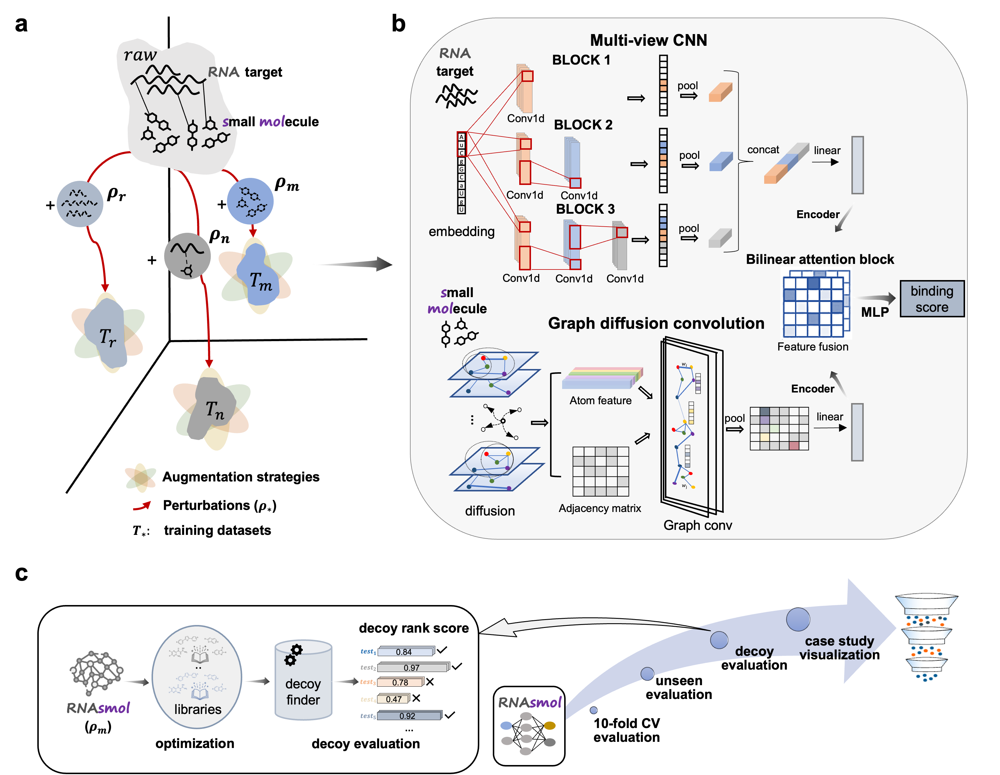
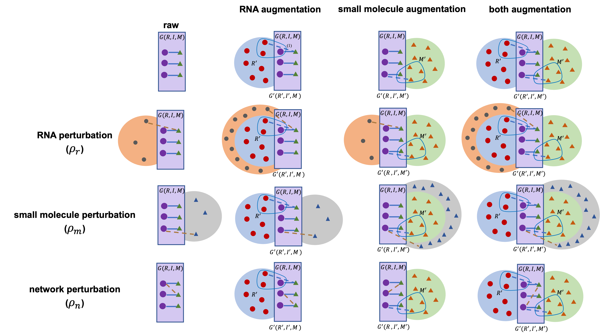

<h1 align="center">RNAsmol</h1>
  <p align="center">
    RNA-ligand interaction scoring via data perturbation and augmentation modeling
  </p>
</p>


[](https://www.python.org/) [](https://pytorch.org/) [](https://colab.research.google.com/drive/1c-xyz...) 


## Overview

<br />
<p align="center">
  <a href="https://github.com/hongli-ma/RNAsmol">
    
  </a>

## Get started

### Prerequisites

* This project was tested on eight 32GB V100 NVIDIA GPUs for model training and multiple 80-core CPUs for multi-threaded preprocessing.
* Software/API used in this project: PyMOL, LigPlot+
* Key requirements: rdkit, torch-geometric

### Environment

Clone the repo and create the evironment for RNAsmol.

``` bash
#Clone the RNAsmol repository from GitHub
git clone https://github.com/hongli-ma/RNAsmol.git
cd ./RNAsmol
#Install the required dependencies
conda env create -n rnasmol -f RNAsmol.yml
```

## Data perturbation with augmentation

### Glimpse of two filtered RNA-ligand networks

<br />
<p align="center">
  <a href="https://github.com/hongli-ma/RNAsmol">
    
  </a>

* RCSB Protein Data Bank (PDB) database: https://www.rcsb.org/
* Repository Of Binders to Nucleic acids (ROBIN) dataset: https://github.com/ky66/ROBIN
  
* PDB RNA-ligand complex filtering:
  (1) https://github.com/lkmoeller/rna_binding/blob/main/rna_binding/data_preparation/rna_data_prep.py
  (2) https://github.com/hongli-ma/RNAsmol/blob/main/scripts/extract_pdb_binding_pocket.py
  (3) https://github.com/hongli-ma/RNAsmol/blob/main/scripts/pocket_res_analyse.py

### Method framework

<br />
<p align="center">
  <a href="https://github.com/hongli-ma/RNAsmol">
    
  </a>

### Databases and tools involved in perturbation and augmentation

* Diverse ChemBridge BuildingBlocks (chbrbb) library:  
* BindingDB protein binder library:
* the COlleCtion of Open NatUral producTs (COCONUT) library:
* filtered ZINC in-vitro bioactive compound library: 

* A genomic catalog of Earth’s microbiomes (GEMs): https://genome.jgi.doe.gov/portal/GEMs/GEMs.home.html
* Unified Human Gastrointestinal Genome (UHGG) collection: https://www.ebi.ac.uk/metagenomics
* The NIH Human Microbiome Project phase 2 (HMP2): https://portal.hmpdacc.org/ 
* TARA Oceans Metagenomes: https://merenlab.org/data/tara-oceans-mags/
* Tibetan Glacier Genome and Gene (TG2G) catalog: https://ngdc.cncb.ac.cn/gsa/browse/CRA011511
* RNAcentral: The non-coding RNA sequence database: https://rnacentral.org/
* The Nucleotide database of NCBI: https://www.ncbi.nlm.nih.gov/nucleotide/

* Infernal: https://github.com/EddyRivasLab/infernal 
* rMSA: https://github.com/pylelab/rMSA


## Implementation

### 1.Activate the created conda environment

`source activate rnasmol`

### 2. Data preprocessing

```         
python rnasmol/preprocessing.py pdb/rnaperturbation  
```

### 3. Model training

```         
python rnasmol/train.py --dataset pdb/rnaperturbation  --lr 5e-5 --batch_size 1024 --save_model
```

### 4. Model test

``` text
python rnasmol/test.py --dataset pdb/rnaperturbation  --model_path 'save/*.pt'
```

## Evaluation

### 1. Classification

### 2. Decoy


## License and Disclaimer

This tool is for research purpose and not approved for clinical use. The tool shall not be used for commercial purposes without permission.
